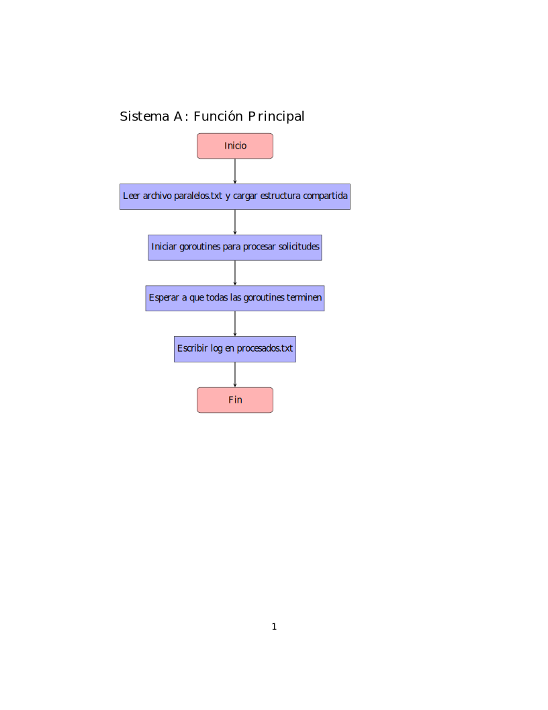

# INF343-2024-2-Tarea3-Grupo6

Antes de implementar los sistemas A y B haga el diagrama de ambos sistemas (puede ver detalles en “Especificaci´on de la entrega”) y luego responda las siguientes preguntas en el README.md de su repositorio.

¿Qué ocurre cuando n= 1 en ambos sistemas?

- **Sistema A**:
  - Solo una goroutine procesa las solicitudes de manera secuencial.
  - No hay conflictos de acceso a recursos compartidos.
  - El sistema opera eficientemente al no requerir exclusión mutua activa.
    
- **Sistema B**:
  - Los mismo que el Sistema A, una sola goroutine maneja las solicitudes de forma secuencial.
  - El acceso exclusivo por paralelo no genera conflictos, pero tampoco se aprovecha la concurrencia.

¿Qué ocurre cuando n= número de solicitudes en ambos sistemas?

- **Sistema A**:
  - Hay una goroutine para cada solicitud, pero el acceso exclusivo a la estructura de datos compartida de paralelos genera bloqueos y reduce el paralelismo efectivo.
  - El tiempo total de procesamiento puede ser alto debido a la serialización de accesos.

- **Sistema B**:
  - Cada goroutine tiene acceso exclusivo solo al paralelo relevante, permitiendo mayor concurrencia.
  - Si las solicitudes afectan paralelos diferentes, se pueden procesar simultáneamente, mejorando la eficiencia. No obstante, las colisiones en paralelos con alta demanda pueden limitar este beneficio.
 
  
¿Como podría mejorar el sistema A para que sea más eficiente?

1. **Dividir los paralelos**:
   - Dividir la estructura compartida en partes más pequeñas, como una estructura separada por paralelo, para minimizar bloqueos globales.
     

2. **Procesar las solicitudes simultaneamente**:
   - Procesar varias solicitudes juntas para reducir el número de accesos exclusivos.

¿Como podría mejorar el sistema B para que sea más eficiente?

1. **Balancear la carga**:
   - Redistribuir solicitudes para minimizar colisiones.

2. **Evitar conflictos en los paralelos**:
   - Implementar algún algoritmo o función condicionales para evitar conflictos en paralelos de alta demanda.

Escriba una analogía de los sistemas A y B con un sistema de inscripción presencial, donde:

• hay personas que gestionan las inscripciones (leen las solicitudes y las procesan)

• hay personas que inscriben a los estudiantes en los paralelos (una por cada paralelo)

• Procesar una solicitud implica ir a la sala correspondiente a ese paralelo y hablar con la persona que
inscribe a los estudiantes en ese paralelo.
comente las diferencias entre ambos sistemas y proponga mejoras.

### Analogía

- **Sistema A**:
  - Hay una oficina central donde los gestores procesan todas las solicitudes.
  - Solo una persona puede trabajar en la inscripción a la vez, lo que genera tiempos de espera para todos.

- **Sistema B**:
  - Cada paralelo tiene su propia oficina.
  - Los gestores trabajan de forma independiente en paralelos diferentes, pero si dos gestores necesitan inscribir estudiantes en el mismo paralelo, uno debe esperar.

### Diferencias entre los sistemas

1. **Sistema A**:
   - Es centralizado y bloqueante: solo una goroutine puede modificar la estructura compartida a la vez.
   
2. **Sistema B**:
   - Es descentralizado: el bloqueo ocurre solo a nivel del paralelo relevante, permitiendo mayor concurrencia.
  

### Tabla comparativa

| Característica            | Sistema A                       | Sistema B                                    |
|---------------------------|----------------------------------|---------------------------------------------|
| Exclusión mutua           | Bloquea toda la estructura.     | Bloquea solo el paralelo afectado.          |
| Nivel de concurrencia     | Bajo, más seguro.               | Alto, más eficiente pero con más riesgo de conflictos. |
| Manejo de solicitudes     | Similar: extrae y procesa una por vez. | Similar: extrae y procesa una por vez.      |
| Registro de inscripciones | Al final de la ejecución.       | Al final de la ejecución.                   |

  
### Propuestas de mejora

1. **Sistema A**:
   - Dividir la estructura compartida en oficinas separadas por paralelo.
   - Implementar un sistema de turnos dinámicos para procesar solicitudes agrupadas.

2. **Sistema B**:
   - Capacitar más gestores por paralelo para evitar cuellos de botella.
   - Prever la distribución de solicitudes según preferencias históricas para balancear la carga.

